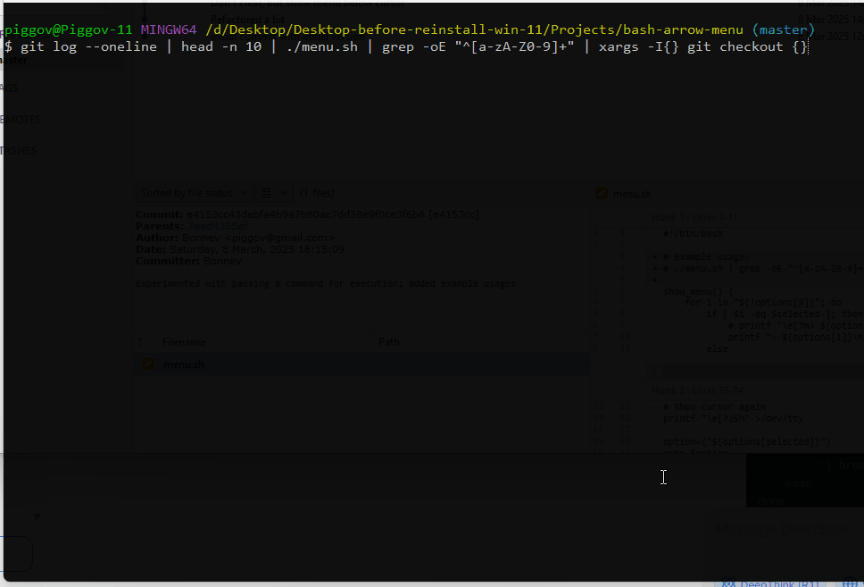

# bash-arrow-menu
A bash script which takes options as input, allows the user to choose between them using the arrow keys and outputs the chosen option to the standard output

## Usage

`options_command | menu.sh | do_stuff_with_user_choice`

Example:

`git log --oneline | head -n 10 | ./menu.sh | grep -oE "^[a-zA-Z0-9]+" | xargs -I{} git checkout {}`

